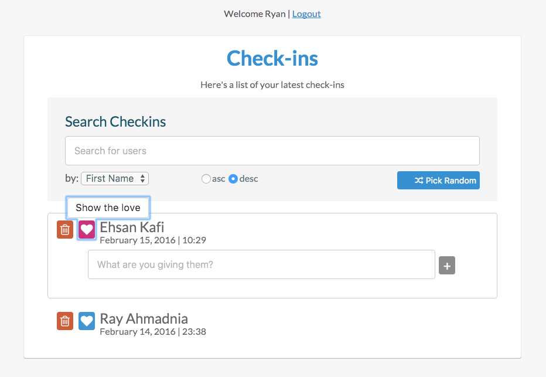

# AngularJS registration

A minimalist check-in to meeting [AngularJS](https://angularjs.org/) app that uses [Firebase](https://firebase.com/) to store/retrieve users' information. Other technologies that are used in this project are as follow:

- [Sass](http://sass-lang.com/)
- [Gulp](http://gulpjs.com/)
- [ngRoute](https://docs.angularjs.org/api/ngRoute)
- [ngAnimate](https://docs.angularjs.org/api/ngAnimate)
- [Font Awesome](https://fortawesome.github.io/Font-Awesome/)

